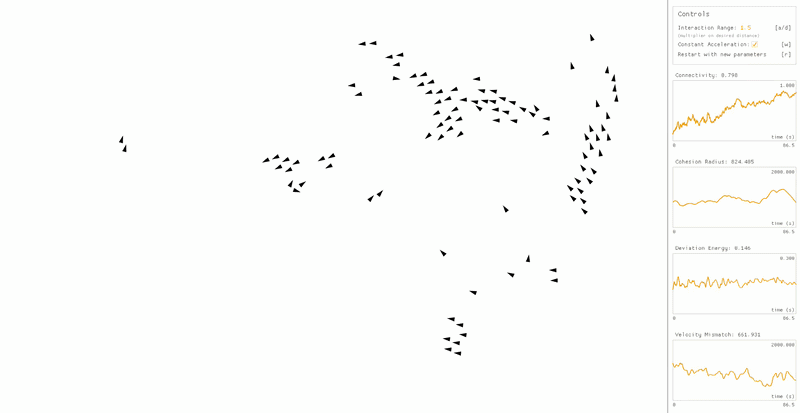
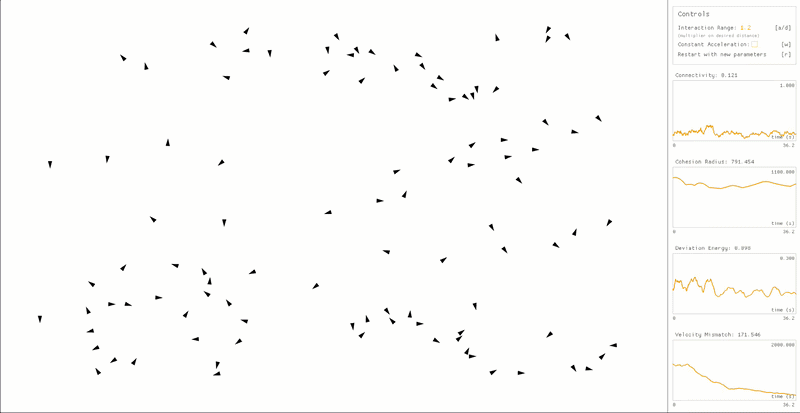
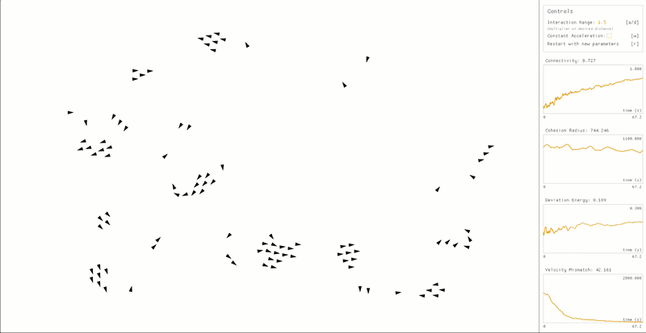
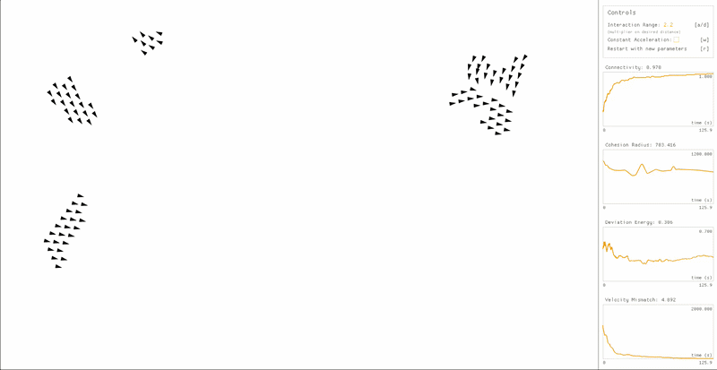
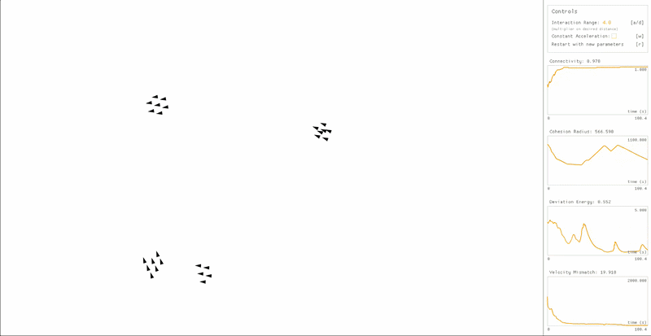
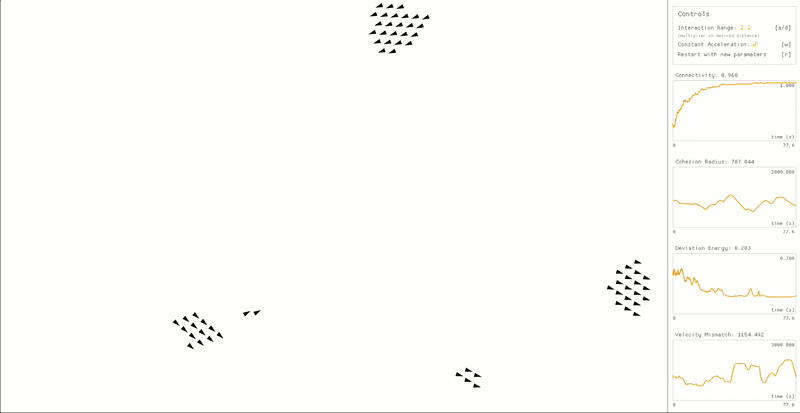
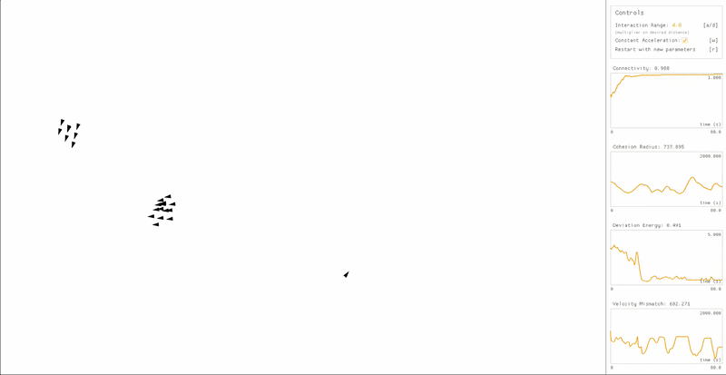

# Flocking Simulation

Boid flocking simulation, replicating results from the paper
[R. Olfati-Saber, "Flocking for multi-agent dynamic systems: algorithms and theory", 2006](https://ieeexplore.ieee.org/abstract/document/1605401),
with inspiration from
[Ben Eater's implementation (GitHub)](https://github.com/beneater/boids).



## Usage

The simulation can be run online
[here!](https://olincollege.github.io/scicomp-p3-il-boids/)

Alternatively, you can clone the repository and run the code locally:

### Rust installation

**Linux/macOS:** (command from [rustup.rs](https://rustup.rs/))

```
curl --proto '=https' --tlsv1.2 -sSf https://sh.rustup.rs | sh
```

**Windows:** Download and run `rustup-init.exe` from
[rustup.rs](https://rustup.rs/).

### Clone and Run

```bash
# Clone the repository
git clone https://github.com/olincollege/scicomp-p3-il-boids.git
cd scicomp-p3-il-boids

# Run simulation
cargo run
```

## Simulation Controls

- [a/d]: Increases and decreases the interaction range of the boids (at what
  distance boids will attract to each other). This is a multiplier on the
  desired distance, so when this value is set to `2.0` boids will be attracted
  to each other when they are within 2x the desired distance. The value is
  clamped between `1.0` and `3.0`.
- [w]: Toggles a small constant acceleration that keeps the simulation moving
  when boids are arranged in a perfect lattice. See
  [Differences from Olfati-Saber, Constant Acceleration](#constant-acceleration)
  for more details.
- [r]: Resets the simulation, applying the current interaction range and
  constant acceleration settings.

## Project Structure

```
src/
├── boid.rs                     // Boid object with flocking algorithm
├── constants.rs                // Simulation constants
├── math.rs                     // Static math functions
├── main.rs                     // Entry point and main simulation
├── metrics.rs                  // Four metrics for evaluating flock quality
└── ui/
    ├── control_panel.rs        // Instruction panel
    ├── metric_graph.rs         // Graphs of metrics
    ├── mod.rs                  // Rust standard for defining module
    └── sidebar.rs              // Overall sidebar layout
```

## Simulation Overview

### Background

In 1986, [Craig Reynolds](https://www.red3d.com/cwr/papers/1987/SIGGRAPH87.pdf)
introduced three rules to simulate the flocking behavior of bird-oid objects:

1. Flock Centering: attempt to stay close to nearby flockmates.
2. Collision Avoidance: avoid collisions with nearby flockmates.
3. Velocity Matching: attempt to match velocity with nearby flockmates.

These three rules became the core of "Boids" flocking simulations.

### R. Olfati-Saber, 2006

In 2006, Reza Olfati-Saber published
[this paper](https://ieeexplore.ieee.org/abstract/document/1605401), creating
three algorithms for flocking that built on Reynolds' core three rules. The
three algorithms are:

1. Basic flocking
2. Flocking with leader following
3. Flocking with leader following and obstacle avoidance

In this project, I implement and expand upon the first algorithm, basic
flocking. There is no top down force in the simulation. Instead, the flocks are
an emergent behavior of each boid follows the flocking algorithm. The basic
flocking which consists of two main parts:

1. **Gradient-based term:** This term pushes the boid to a set desired distance
   from its neighbors, attracting to boids that are too far away and repelling
   from boids that are too close. Formally, this is the negative gradient of the
   collective potential energy function, which is minimized when all agents are
   at the desired distance.
2. **Consensus term:** This is the velocity matching term, pushing the boid's
   velocity towards a weighted average of its neighbors' velocities, based on
   distance.

### Differences from Olfati-Saber

#### Constant Acceleration

Under Olfati-Saber's basic flocking algorithm, once boids arranged into a
perfect lattice (all spaced at the desired distance) they have have no incentive
to continue moving and end up nearly stationary. To keep the simulation moving,
I added a small constant acceleration to each boid. This does change which
interaction ranges lead to stable flocking, and thus this constant acceleration
is toggleable.

#### Border Avoidance

Olfati-Saber's simulation has no borders, and boids are allowed to fly out of
frame. I wanted to keep all boids in frame, so I added a force that pushes boids
back towards the center of the screen when they get close to the border. This is
the same implementation used by [Ben Eater](https://github.com/beneater/boids).

## Results

All simulations below are run with 100 boids.

### Metrics

Olfati-Saber defines four metrics to determine what constitutes a flock:

1. **Connectivity:** A value from 0 to 1, where 1 indicates all birds are in one
   flock and 0 indicates no connectivity. Calculated as $\frac{n-c}{n-1}$ where
   $n$ is the number of boids and $c$ is the number of flocks.
2. **Cohesion Radius:** The maximum distance from the flock center to any boid
   in the system. Minimizing this value indicates a cohesive flock.
3. **Deviation Energy\*:** The amount of energy needed to get each boid to a
   desired distance away from other boids. A positive value roughly below 1 (not
   mathematically defined bounded). A value of 0 indicates all boids are exactly
   at the desired distance from each other.
4. **Velocity Mismatch**: The average difference in velocity between each boid
   and the average velocity of all boids in the system. A value of 0 indicates
   all boids are moving at the same velocity.

\* Deviation Energy was difficult to minimize in my implementation, as boids
will often reach equilibrium by overlapping each other in the center of a flock.
As such, deviation energy will not reduce by too much even when flocks appear to
form.

### Without Constant Acceleration

#### Interaction Range = 1.2

An interaction range of 1.2 is used in Olfati-Saber's paper, and the results
match that with this interaction range, the basic flocking algorithm
(algorithm 1) does not lead to stable flocking.

Looking at the metrics, while velocity mismatch drops from the initial value,
connectivity and cohesion radius remain high, indicating no stable flocking.



Olfati-Saber stops here with algorithm 1, concluding that algorithm 1 will lead
to fragmentation. However, I found that algorithm 1 can lead to stable flocking
with a higher interaction range.

#### Interaction Range = 1.5

With an interaction range of 1.5, various stable flocks begin to form after a
minute of simulation time. This can be seen in the rise in connectivity and drop
in velocity mismatch. However, cohesion radius and deviation energy remain
relatively unchanged, as there is not one main flock.

That one main flock may form with more time, but as mentioned in
[Differences from Olfati-Saber, Constant Acceleration](#constant-acceleration),
the boids slow to a halt once they enter a perfect lattice.



#### Interaction Range = 2.2

With an interaction range of 2.2, the fragmented flocks are able to form into
three main flocks after about two minutes of simulation time.

Connectivity nearly reaches 1, and velocity mismatch drops very low. Deviation
energy drops slightly from the initial value. Cohesion radius remains high
however, as the large flocks are on the opposite sides of the screen, meaning
the average position of all boids is in the middle of the screen, far from all
boids.



#### Interaction Range = 4.0

Even with an interaction range of 4.0, the boids are not able to form into one
main flock after two minutes of simulation time. Flocks move too slowly to find
each other, even with an increased interaction range.

Additionally, overlapping of boids is much more common with a higher interaction
range, likely because all boids are attracted towards the very center of the
flock.



### With Constant Acceleration

#### Interaction Range = 1.5

Adding constant acceleration to a 1.5 interaction range leads to much more
movement even after flocks form. However, this movement causes flocks to
frequently break and reform.

This can be seen in the metrics, as cohesion radius, deviation energy, and
velocity mismatch all continue to fluctuate. Connectivity increases from its
initial value, then similarly begins to fluctuate.


#### Interaction Range = 2.2

Similarly to the case with no constant acceleration, an interaction range of 2.2
leads to a few main flocks after a minute and a half of simulation time.
However, in this case the flocks remain more dynamic, leading to a higher chance
of these flocks finding each other.



#### Interaction Range = 4.0

When constant acceleration is added to an interaction range of 4.0, all but one
of the boids are able to find each other after a minute and a half of simulation
time. However, due to the high amounts of overlap that come with higher
interaction ranges, the main flock has very little area, making it difficult for
that final boid to find the main flock.


